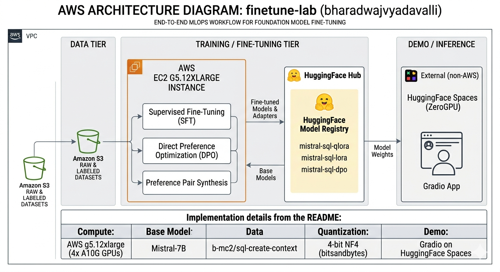

# finetune-lab

End-to-end fine-tuning sprint: Mistral-7B → Text-to-SQL, comparing QLoRA SFT, LoRA SFT (bf16), and DPO.

## Live Demo

**[Try it now on HuggingFace Spaces](https://huggingface.co/spaces/bharadwajvyadavalli/mistral-sql-demo)**

Compare all three fine-tuning approaches side-by-side on the same prompt.

## Trained Adapters

| Technique | HuggingFace Hub | Description |
|-----------|-----------------|-------------|
| QLoRA SFT | [mistral-sql-qlora](https://huggingface.co/bharadwajvyadavalli/mistral-sql-qlora) | 4-bit quantized base + LoRA |
| LoRA SFT | [mistral-sql-lora](https://huggingface.co/bharadwajvyadavalli/mistral-sql-lora) | bf16 precision + LoRA |
| DPO | [mistral-sql-dpo](https://huggingface.co/bharadwajvyadavalli/mistral-sql-dpo) | Preference-tuned on QLoRA |

## Results

Trained on 10k samples from `b-mc2/sql-create-context`:

| Phase | Technique | Training Time | Final Loss |
|-------|-----------|---------------|------------|
| 1 | QLoRA SFT | 9 min | 0.48 |
| 2 | LoRA SFT (bf16) | 7 min | 0.48 |
| 3 | DPO | <1 min | 0.69 |

**Key finding:** LoRA bf16 trains ~25% faster than QLoRA (2.65s vs 3.52s per step) with similar final loss.

## What Each Technique Does

- **QLoRA SFT**: Memory-efficient fine-tuning using 4-bit quantization. Fits 7B model training in ~6GB VRAM.
- **LoRA SFT (bf16)**: Full bf16 precision training with LoRA adapters. Faster compute but needs more VRAM.
- **DPO**: Direct Preference Optimization - learns to prefer correct SQL over model's incorrect outputs.

## Stack

| Component | Choice |
|-----------|--------|
| Base model | `mistralai/Mistral-7B-v0.1` |
| Training data | `b-mc2/sql-create-context` (78k rows) |
| DPO data | Synthesized from QLoRA outputs vs gold SQL |
| Compute | AWS g5.12xlarge (4× A10G) |
| Framework | HuggingFace transformers, peft, trl, accelerate |
| Quantization | bitsandbytes 4-bit NF4 |
| Demo | Gradio on HuggingFace Spaces (ZeroGPU) |

## Architecture



## Repo Layout

```
finetune-lab/
├── configs/                 # YAML configs for each training run
│   ├── qlora_sft.yaml
│   ├── lora_sft.yaml
│   └── dpo.yaml
├── src/
│   ├── prompts.py           # Prompt formatting (single source of truth)
│   ├── data/spider_prep.py  # Dataset preparation
│   ├── train/train_sft.py   # SFT training (QLoRA + LoRA)
│   ├── train/train_dpo.py   # DPO training
│   ├── dpo_synth/           # Build preference pairs
│   └── eval/                # SQL evaluation
├── app/
│   ├── app.py               # Gradio app for HF Spaces
│   └── requirements.txt
└── data/                    # Training data (gitignored)
```

## Quick Start

### Use the pre-trained adapters

```python
from peft import PeftModel
from transformers import AutoModelForCausalLM, AutoTokenizer

model = AutoModelForCausalLM.from_pretrained("mistralai/Mistral-7B-v0.1")
model = PeftModel.from_pretrained(model, "bharadwajvyadavalli/mistral-sql-qlora")
tokenizer = AutoTokenizer.from_pretrained("mistralai/Mistral-7B-v0.1")

prompt = """### Instruction:
You are a SQL expert. Given a database schema and a natural-language question, write a SQL query that answers the question.

### Schema:
CREATE TABLE employees (id INT, name TEXT, salary INT, department TEXT)

### Question:
What are the names of employees in the Sales department?

### SQL:
"""

inputs = tokenizer(prompt, return_tensors="pt")
outputs = model.generate(**inputs, max_new_tokens=100)
print(tokenizer.decode(outputs[0]))
# Output: SELECT name FROM employees WHERE department = "Sales"
```

### Train your own

```bash
# 1. Prepare data
python -m src.data.spider_prep

# 2. Train (requires GPU)
accelerate launch src/train/train_sft.py --config configs/qlora_sft.yaml
```

## Cost

| Resource | Cost |
|----------|------|
| AWS EC2 (g5.12xlarge, 1 hr) | ~$6 |
| HuggingFace Pro (ZeroGPU) | $9/mo |
| S3 storage | ~$0.01 |

**Total: ~$6 for training + $9/mo for live demo**

## License

MIT
